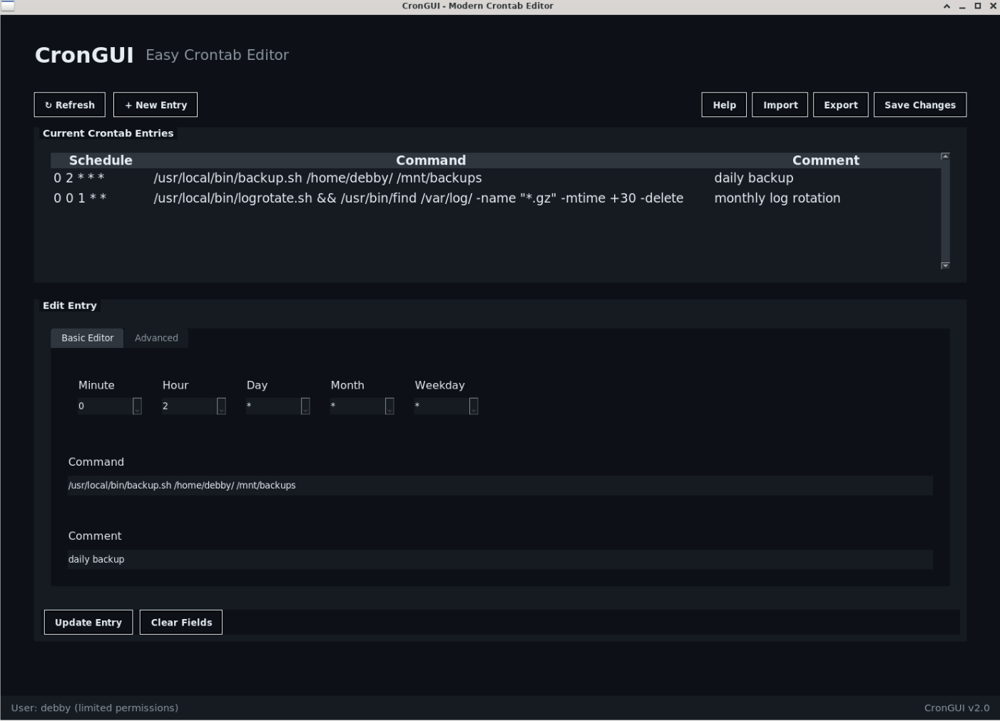

# crongui



attempt at making a GUI crontab editor. originally to help colleagues who weren't so used to cron.

copied over my from Gitea now that it is "public-ready", and hoping others will benefit.

# Features

- Loads current user's cron entries when the application opens

- Creates a backup before making any changes

- Easy add and save new cronjobs

- Drop down menus for users unfamiliar with cron's schedule structure

- 'Advanced' / 'Raw' tab for users who prefer to type out the full job, including schedule. 

# Install

adjust the below to suit your version of Python.


- Requirments:
python3
python3-tk
python3-setuptools

```python3 setup.py install```

or if you prefer pip

```pip install git+https://github.com/efferone/crongui.git```

then run it with:
```crongui```

or just use the wrapper script to start the application without installing (in beta):
```./crongui-wrapper.sh```

Please feel free to make improvments, in a dev environment you might want to use

```pip install -e .```

